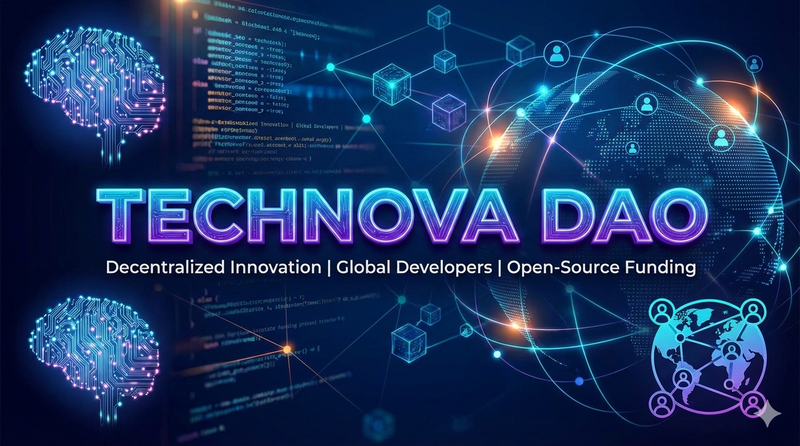

# 🚀 TechNova DAO

## 🌐 Visão Geral
A **TechNova DAO** é uma Organização Autônoma Descentralizada focada em fomentar a inovação tecnológica. Nosso objetivo é financiar projetos open-source e apoiar desenvolvedores através de governança transparente e colaborativa.

## 🎯 Missão
Democratizar o acesso a recursos, educação e financiamento para criadores de tecnologia, promovendo um ecossistema justo na Web3.

## 🏗️ Estrutura do Projeto
O projeto está organizado da seguinte forma:
* **/docs**: Detalhamento da governança, economia de tokens e propostas.
* **/assets**: Identidade visual do projeto.
* **LICENSE**: Licença de uso do projeto.

## 🔗 Links Rápidos
* [Entenda a Governança](docs/governanca.md)
* [Modelo de Tokenomics](docs/tokenomics.md)
* [Exemplo de Proposta (TIP-001)](docs/TIP-001.md)

---
*Projeto desenvolvido para o desafio da DIO.*
